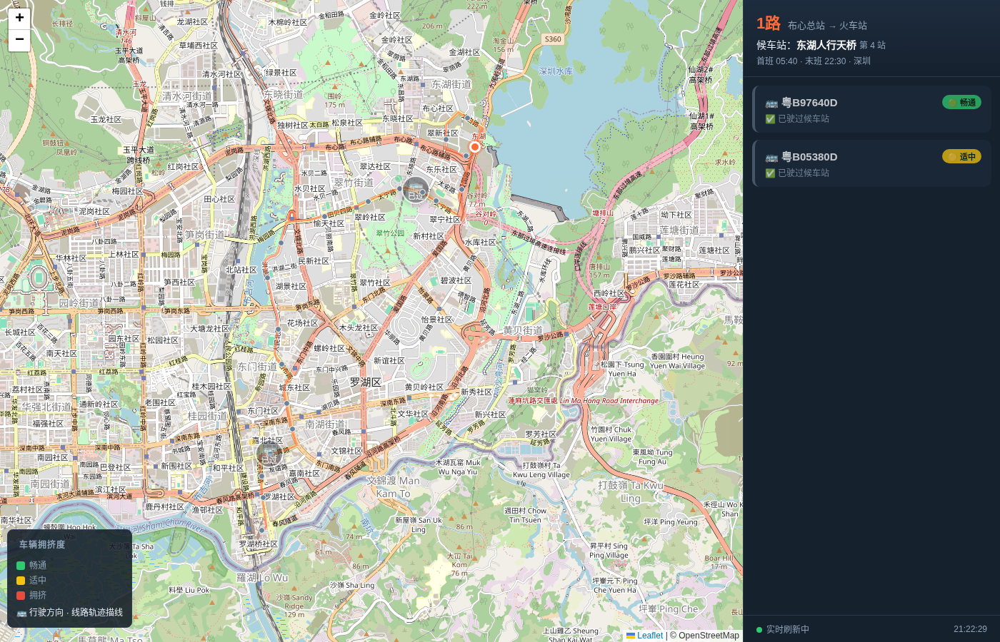
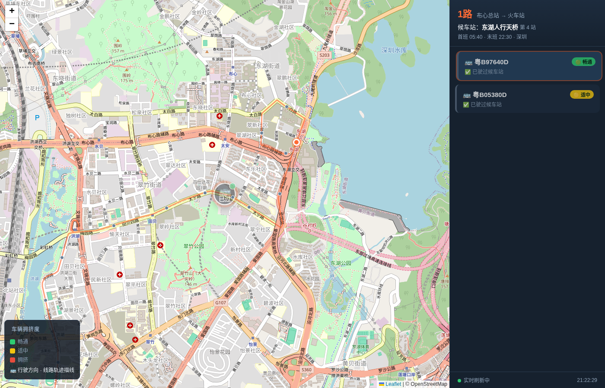

<p align="center">
  
</p>

<h1 align="center">🚏 Bus Live</h1>

<p align="center">
  <strong>A self-hosted, map-based realtime bus tracker</strong><br>
  Realtime vehicle positions · Countdown stops & ETA · Crowdedness · Back-queue list<br>
  No signup · No API key · One command to run
</p>

<p align="center">
  =18">
  
  
</p>

<br>

## 📸 Preview

| Map view with live bus positions | Side panel: incoming bus cards |
|:---:|:---:|
|  |  |

> Built-in demo route (Shenzhen Line 1 → Donghu Pedestrian Bridge) runs immediately after `node src/server.js`.
> Supports 477+ cities across China.

---

## ✨ Features

- **🧭 Real-time vehicle positions** on a Leaflet / OpenStreetMap base map — bus icons plotted at live WGS-84 coordinates
- **📏 Stops remaining** for each approaching bus — `17 - currentOrder = "still 4 stops"`
- **⏰ ETA to your stop** — minutes + wall-clock estimate for every bus heading your way
- **🚍 Back-queue list** — ordered by arrival time, cars that already passed greyed out
- **🟢🟡🔴 Crowdedness** — `crowd` (comfortable), `mid` (moderate), `riders-packed` (tight) — sourced from operator's live telemetry
- **🗺️ Route polyline** — the full bus trajectory drawn on the map
- **🔧 Zero config** — ships with a demo route (Shenzhen Line 1 → Donghu Pedestrian Bridge). Just run and open browser
- **🔐 No registration, no API key, no account** — data sourced via reverse-engineered public transit API
- **📦 Zero NPM dependencies** — pure Node.js (native modules only)

---

## Architecture

```
┌──────────────┐     GET /api/line?cfg=...      ┌──────────────────┐
│  Browser     │ ←────────────────────────────      │  bus-live Server │
│  (Leaflet +  │     { line, stations, route,    │  (Node.js, no    │
│   OSM)       │       buses[], fetchedAt }      │   deps)          │
├──────────────┤                                  ├──────────────────┤
│ Map display  │                                  │  /api/line (BFF) │
│ Bus icons    │                                  │  Cache + poll    │
│ Right panel  │                                  │  Static files    │
└──────────────┘                                  └────────┬─────────┘
                                                            │
                                          ┌─────────────────┼─────────────────┐
                                          │ chelaile.js      │ find.js         │
                                          │ (reverse-eng.    │ (CLI search for │
                                          │  Chelaile API)   │  lines & stops) │
                                          └──────────────────┴─────────────────┘
                                                            │
                                             ┌──────────────┴──────────────┐
                                             │  web.chelaile.net.cn API    │
                                             │  (MD5 sign + AES-256-ECB)  │
                                             └─────────────────────────────┘
```

### Data flow

1. **Server** starts → immediately fetches line detail, real-time buses, and route polyline from the upstream; caches in memory
2. Every **10 s** the server re-polls the upstream (configurable) — so your browser never hits the upstream directly
3. **Browser** polls `/api/line` every **5 s**, gets the aggregated JSON, renders map layers and the side-panel cards
4. On upstream failure the server serves the **last known good data** with a `stale: true` flag — no blank screen

---

## Quick Start

### Prerequisites

- **Node.js >= 18** (tested on 22, 24)
- Only OS-native modules; no `npm install` needed

### Run the demo

```bash
git clone https://github.com/Garfield-Wuu/bus-live.git
cd bus-live
node src/server.js
```

Open **`http://localhost:8787`** in your browser.

You'll immediately see **Shenzhen Line 1 → Donghu Pedestrian Bridge** with live bus data.

### Configure your own route

Copy the env template, fill in your route:

```bash
cp .env.example .env
# Edit .env with your city, line, and stop information
node src/server.js
```

Or pass everything via environment variables:

```bash
BUS_CITY_ID=014 \
BUS_LINE_ID=0755-00010-0 \
BUS_STOP_NAME=东湖人行天桥 \
BUS_STOP_ORDER=4 \
node src/server.js
```

### Find your route IDs

```bash
# Search for a line by keyword
node src/find.js --city 014 --kw 1路

# With --detail it also lists all stops of the first match
node src/find.js --city 014 --kw 1路 --detail
```

The tool prints the `lineId`, `stopName`, and `stopOrder` you need for `.env`.

---

## Configuration Reference

| Variable | Description | Default |
|---|---|---|
| `BUS_CITY_ID` | Chelaile city code (e.g. `014` Shenzhen, `027` Beijing, `034` Shanghai) | `014` |
| `BUS_CITY_NAME` | Display name | `深圳` |
| `BUS_LINE_ID` | Line identifier from search | `0755-00010-0` |
| `BUS_LINE_NO` | Line display name | `1路` |
| `BUS_STOP_NAME` | Stop display name | `东湖人行天桥` |
| `BUS_STOP_ORDER` | Stop order index (1-based) on the line | `4` |
| `BUS_PORT` | HTTP listen port | `8787` |
| `BUS_UPSTREAM_MS` | Interval (ms) to poll upstream | `10000` |

All variables can be set in `.env` (excluded via `.gitignore`), as environment variables, or as CLI flags (`--city=014`). Priority: **CLI args > env vars > .env file > defaults**.

> 💡 Use `.env` for your private route — it's in `.gitignore` and won't be committed.

---

## Supported Cities

The upstream (Chelaile) covers **477+ cities** across China, including but not limited to:

北京(027) · 上海(034) · 深圳(014) · 广州(053) · 成都(045) · 杭州(054) · 武汉(063) · 南京(049) · 重庆(076) · 西安(070) · 长沙(072) · 苏州(050) · 天津(093) · 郑州(073) · 东莞(055) · 青岛(060) · 沈阳(056) · 宁波(068) · 佛山(065) · 厦门(066) · 大连(062) · 无锡(064) · 合肥(069) · 昆明(067) · 哈尔滨(057) · 济南(071) · 福州(079) · 温州(075) · 长春(074) · 石家庄(084) · 常州(080) · 泉州(082) · 南昌(083) · 贵阳(085) · 太原(086) · 烟台(090) · 南宁(087) · 珠海(077) · 金华(118) · 徐州(095) · 海口(089) · 乌鲁木齐(091) · 呼和浩特(097) · 兰州(099) · 中山(119) · 惠州(101) · 绍兴(103) · 嘉兴(102) · 西宁(116) · 银川(117) · 拉萨(115) ...

Run `node src/find.js --city 027 --kw "特"`  with your own city ID to check coverage.

---

## How It Works — Reverse Engineering Notes

This project accesses [Chelaile](https://web.chelaile.net.cn) (车来了) public transit real-time data via a **reverse-engineered** API.

**Mechanism:**
- Endpoint: `https://web.chelaile.net.cn/api/bus/...`
- Auth: MD5 signing (`cryptoSign`) with salt `qwihrnbtmj` + AES-256-ECB decryption with fixed key
- Parameters mimic the Chelaile WeChat mini-program (`v: 3.11.28`, `src: weixinapp_cx`, etc.)
- Response wrapped in `**YGKJ{...}YGKJ##` envelope; decryption layer transparently handled by `chelaile.js`

**Ethics & risk:**
- The upstream **Chelaile is a legitimate service providing free real-time bus data through its mini-program**. This project merely makes that data accessible programmatically with a map-based UI — it does not scrape, abuse, or monetise.
- The interface is rate-limited by the 10 s server-side cache; the browser never hits Chelaile directly.
- **No warranty**: the upstream may change authentication at any time without notice. Built-in stale-data fallback keeps the page from going blank.

---

## License

[MIT](LICENSE) © 2026 [Garfield-Wuu](https://github.com/Garfield-Wuu)

---

## Disclaimer

```
THIS SOFTWARE IS PROVIDED "AS IS", WITHOUT WARRANTY OF ANY KIND.

The real-time bus data is sourced from a reverse-engineered third-party API.
The upstream service (Chelaile / 车来了) may change, block, or rate-limit
access at any time. The author is not responsible for any service disruption
or data inaccuracy.

This project is for educational and personal use only. Do not use it in
production environments where data reliability is critical.

If you are the operator of the upstream service and believe this project
violates your terms of service, please open an issue — I will take it down
immediately.
```